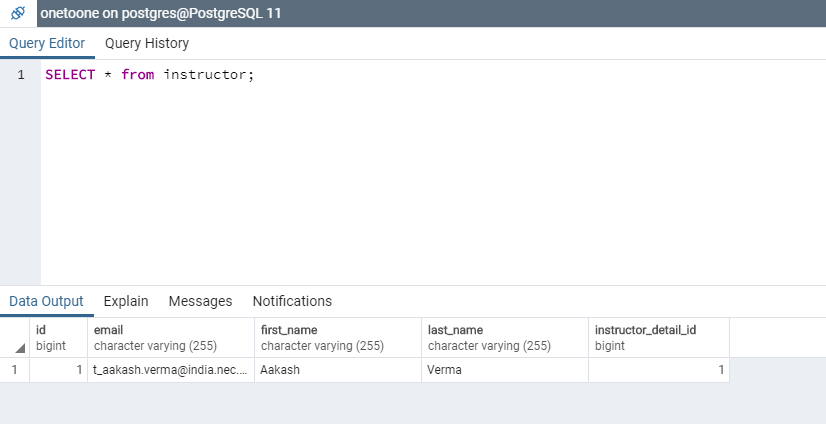
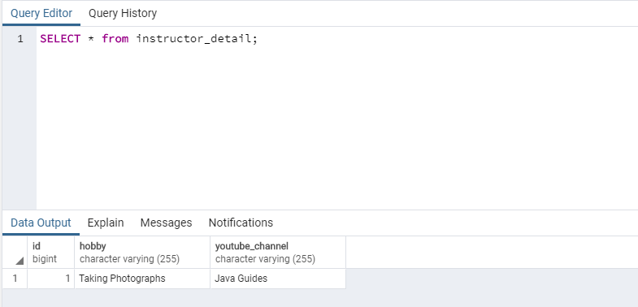

# Spring-Boot-Jpa-Hibernate-One-To-One-Mapping-ExampleApplication
This repository is based on how to implement step by step one-to-one entity mapping using JPA/Hibernate with Spring Boot, Spring Data JPA, and PostgreSQL database. The @OneToOne JPA annotation is used to map the source entity with the target entity. In this example, we create Instructor and InstructorDetail entities and we make a one-to-one mapping between them.

<h2>Tools and Technologies used</h2>
<ul>
  <li>Spring boot 2+</li>
  <li>Hibernate 5+</li>
  <li>JDK 1.8+</li>
  <li>Maven 3+</li>
  <li>IDE - STS or Eclipse</li>
  <li>Spring Data JPA</li>
  <li>PostgreSQL 10+</li>
</ul>
 
<h2>Development Steps</h2>
<ul>
  <li>Create Spring boot application</li>
  <li>Maven pom dependencies</li>
  <li>Project Structure</li>
  <li>Configuring the Database and Logging</li>
  <li>Defining the Domain Models</li>
  <li>Defining the Repositories</li>
  <li>Spring Boot Controller - InstructorController.java</li>
  <li>Run the application</li>
</ul>
 
<h4>The following image shows the table structure of <b>instructor</b> table.</h4>

 
<h4>The following image shows the table structure of <b>instructor_detail</b> table.</h4>

